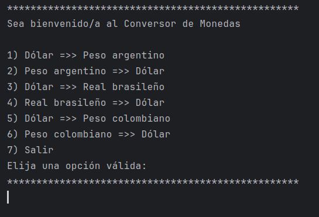
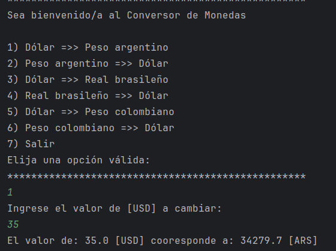
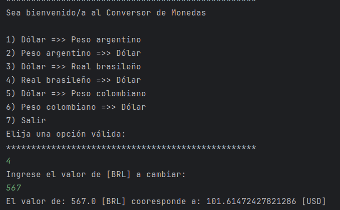
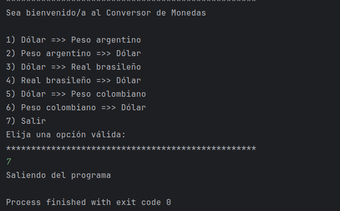

# conversorDeMonedas
Challenge de la formación para back end en Java de Oracle y Alura Latam

## Descripción
Este proyecto da al usuario la posibilidad de convertir las monedas en USD, ARS, BRL y COP entre sí. Además, se da una última opción para salir del menu

**Menú con opciones:**

**Conversión de USD a ARS:**

**Conversion de BRL a USD:**

**Finalización del programa:**

